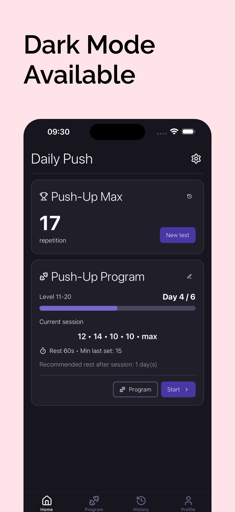

# Daily Push - Landing Page  

🚀 **Daily Push** is an app that helps you **progress in push-ups step by step**.  
Track your sessions easily and use dark mode for late-night workouts.  

📱 Currently in **alpha testing** — coming soon to the app stores!  

This repository only contains the presentation website of the app.  

👉 Check out the landing page here: [daily-push-landing.vercel.app](https://daily-push-landing.vercel.app/)  

---

## About the app  

**Daily Push** is a mobile application designed to:  
- Follow a progressive push-up training program  
- Build strength and endurance at your own pace  
- Track your progress with a simple interface  
- Train anytime, with dark mode for night sessions

  &nbsp;&nbsp;&nbsp;
  &nbsp;&nbsp;&nbsp;
  &nbsp;&nbsp;&nbsp;
  &nbsp;&nbsp;&nbsp;
  

